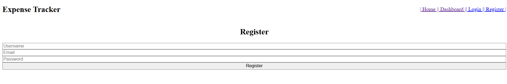
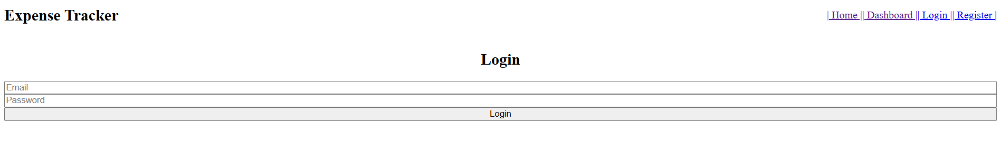
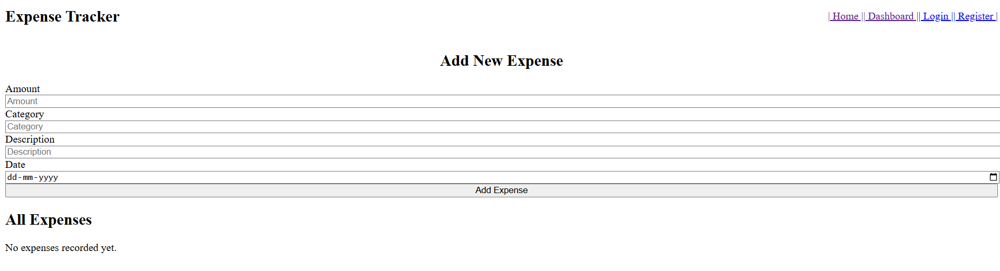
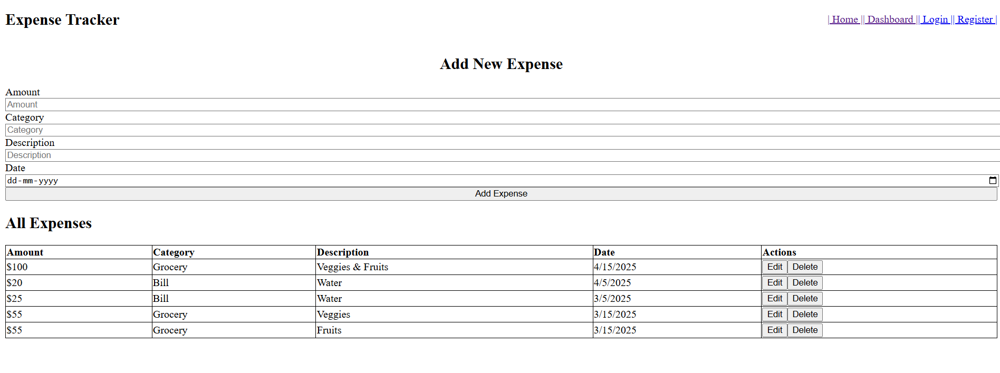
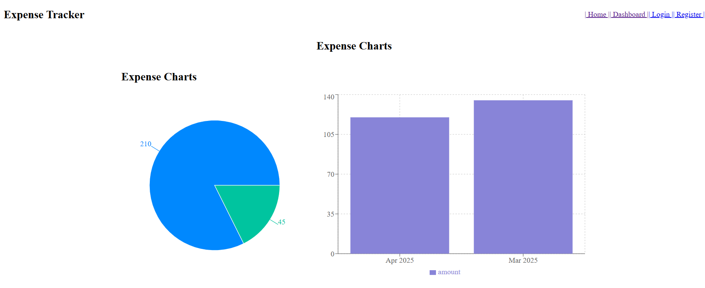

# Expense Tracker

Welcome to my full-stack Expense Tracker application.
This project helps users manage their personal expenses securely with authentication, expense tracking, and visual analytics.

---

## Features

- ✅ User Registration and Login (JWT authentication)
- ✅ Add, edit, and delete your expenses
- ✅ Only you can view your own data
- ✅ Pie chart + Bar graph to visualize spending
- ✅ Clean UI with TailwindCSS
- ✅ Responsive design for all screen sizes

---

## Tech Stack

| Layer      | Tools Used                                 |
|------------|---------------------------------------------|
| Frontend   | React, Vite, Tailwind CSS                   |
| Backend    | Node.js, Express                            |
| Database   | MongoDB Atlas (Mongoose ORM)                |
| Auth       | JSON Web Token (JWT), bcryptjs              |
| Charts     | Recharts (Bar and Pie chart components)     |

---

## How to Run This Project Locally

### 1. Clone the Repository

```bash
git clone https://github.com/Swaroop-Haridas/Expense_Tracker.git
cd Expense_Tracker
```
### 2. Setup Backend
```
cd backend
npm install
```
Create a .env file inside backend/ and add:
MONGO_URI=your_mongodb_connection_string
JWT_SECRET=yourSuperSecretKey
PORT=5000
```
Run the backend:
npm run dev
```
### 3. Setup Frontend
```
cd ../frontend
npm install
npm run dev
```

---

## User Workflow
1. Register with your email and password.
2. Login to your account (secure JWT-based auth).
3. Add expenses with amount, category, description, and date.
4. View your spending visually via charts.
5. Edit/delete any of your own expenses.
6. Logout when done — data remains private to your account.

## Screenshots
### Register Page


### Login Page


### Home Page (No Data)


### Home Page (With Data)


### Dashboard (Charts)


## Security Features
∘ JWT-based Authentication
∘ Password Hashing with bcryptjs
∘ Protected API Routes
∘ User-specific Data Access
